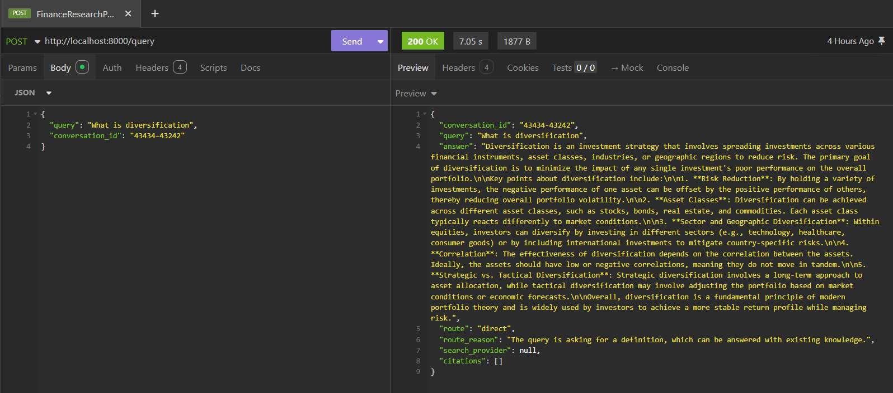
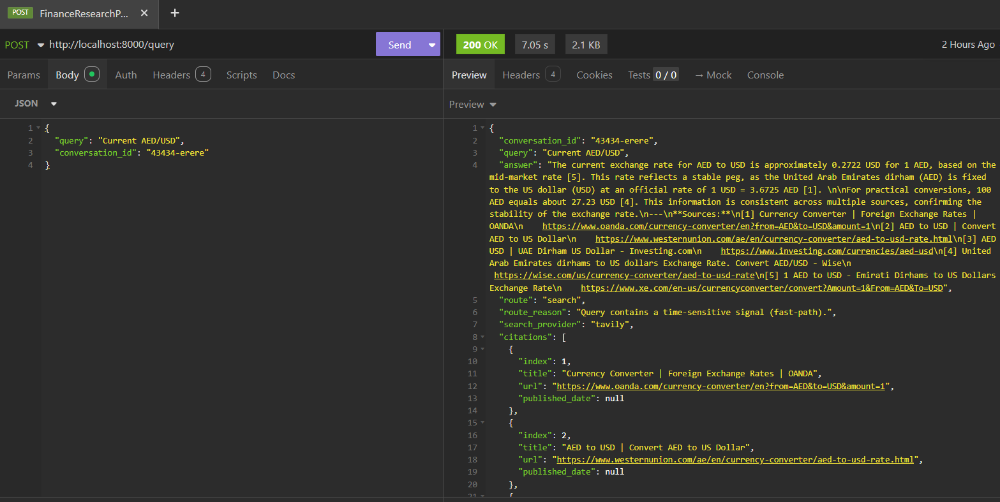

# Finance Research Agent

An **LLM-powered internet-search agent** for investment research, built with
**LangGraph + LangChain** and served through a production-oriented **FastAPI**
REST API.

The agent decides *when to search the web vs. answer from its own knowledge*,
synthesises grounded answers with **in-text citations**, **streams** responses
token-by-token, and remembers context across a conversation.

---

## How the agent routes a query

The first decision the agent makes is whether a query needs a **live web search**
or can be answered **directly** from the model's own knowledge. This is handled by
`QueryRouter.route()` (`app/agent/router.py`) in two stages: a cheap regex
match that matches obviously time-sensitive queries (e.g. anything
mentioning *current*, *latest*, *today*, *stock price*) without spending an LLM
call, and — for everything else — a temperature-0 LLM classifier constrained via
`with_structured_output` to return exactly `"search"` or `"direct"` plus a reason.
The last four conversation turns are passed in as context so follow-up questions
route correctly.

```
route(query, history)
│
├─ regex _REALTIME_PATTERNS matches query?
│     YES ──────────────────────────────▶ RouteDecision(route="search", fast_path=True)   [no LLM]
│     NO
│      │
│      └─ build messages: [ROUTER_SYSTEM_PROMPT, query + last-4-turns history]
│         │
│         └─ LLM (temp=0, structured) ──▶ RouteDecision(route="search"|"direct", reason=...) [LLM]
```

## Highlights

| Capability | How it's delivered |
|---|---|
| **Smart query routing** | LangGraph conditional graph + LLM classifier (`app/agent/router.py`) with a regex match for obviously time-sensitive queries. |
| **Web search** | Pluggable `SearchProvider` interface — **Tavily** (prod) and **DuckDuckGo** (key-free demo) behind a factory (`app/tools/`). |
| **Grounded synthesis** | Answers built *only* from retrieved sources, with anti-hallucination prompting. |
| **In-text citations** | Numbered `[n]` references inline + an auto-appended source list (`app/agent/citations.py`). |
| **Streaming** | Server-Sent Events via `POST /query/stream`, multiplexing LangGraph `messages` + `updates` stream modes. |
| **Conversation memory** | SQLite (demo) through a `ConversationStore` interface → swap to Postgres/Redis in prod (`app/memory/`). |
| **Production posture** | Pydantic-settings config, structured logging, typed exceptions → HTTP mapping, Docker multi-stage build, Gunicorn/Uvicorn workers, health checks. |

---

## Architecture at a glance

```
            ┌──────────────────────── FastAPI ────────────────────────┐
            │  POST /query   POST /query/stream (SSE)   GET /health     │
            └───────────────────────────┬──────────────────────────────┘
                                         │  FinanceResearchAgent (façade)
                                         ▼
   ┌──────────────────────────── LangGraph ────────────────────────────┐
   │   route ──search──▶ search ──▶ generate_with_context ──▶ END        │
   │     └────direct────────────▶ generate_direct ──────────▶ END        │
   └────────────┬───────────────┬──────────────────┬─────────────────────┘
                │               │                  │
        QueryRouter      SearchProvider       LLMProvider
        (LLM classify)   Tavily│DuckDuckGo    OpenAI (LangChain)
                                                    │
                                          ConversationStore (SQLite)
```

See **[docs/DEPLOYMENT.md](docs/DEPLOYMENT.md)** for the cloud (AWS) deployment
architecture, and **[docs/API.md](docs/API.md)** for the full endpoint reference.

---

## Quick start (local, no Docker)

```bash
# 1. Create a virtualenv and install deps
python -m venv .venv
.venv\Scripts\activate          # Windows PowerShell
# source .venv/bin/activate     # macOS/Linux
pip install -r requirements.txt

# 2. Configure
copy .env.example .env          # then edit: add OPENAI_API_KEY (and TAVILY_API_KEY if you have one)

# 3. Run
uvicorn app.main:app --reload

# 4. Open the interactive docs
#    http://localhost:8000/docs
```

> No Tavily key? Leave it blank — `SEARCH_PROVIDER=auto` falls back to
> DuckDuckGo so the demo works with **only** your OpenAI key.

## Quick start (Docker)

```bash
$env:OPENAI_API_KEY="sk-..."     # PowerShell
docker compose up --build
# → http://localhost:8000/docs
```

---

## Try it

```bash
# Direct (no search): conceptual question
curl -X POST http://localhost:8000/query -H "Content-Type: application/json" ^
  -d "{\"query\": \"What is diversification?\"}"

# Search: time-sensitive question
curl -X POST http://localhost:8000/query -H "Content-Type: application/json" ^
  -d "{\"query\": \"What was the latest Fed interest rate decision?\"}"

# Streaming (SSE)
curl -N -X POST http://localhost:8000/query/stream -H "Content-Type: application/json" ^
  -d "{\"query\": \"Current EUR/USD rate?\"}"
```


## API in action

The screenshots below show the agent responding in **Insomnia**, demonstrating
both routing paths.

**Direct path** — a conceptual question the agent answers from its own knowledge
(`route: "direct"`, no search, no citations):



**Search path** — a time-sensitive question that triggers a live web search and
returns a grounded answer with in-text `[n]` citations and a source list
(`route: "search"`):



---

## Project layout

```
app/
├── main.py              # FastAPI app factory + lifespan (composition root)
├── config.py            # Pydantic settings
├── api/                 # REST layer: schemas, routes, DI, auth
├── agent/               # LangGraph agent: state, router, nodes, graph, citations, façade
├── llm/                 # LLMProvider abstraction (OpenAI impl)
├── tools/               # SearchProvider abstraction + Tavily/DuckDuckGo + factory
├── memory/              # ConversationStore abstraction + SQLite impl
└── core/                # logging, exceptions
docs/                    # API.md, DEPLOYMENT.md (architecture diagrams)
tests/                   # unit tests (router fast-path, citations, store, API)
Dockerfile, docker-compose.yml, gunicorn_conf.py
```

---

## Testing

```bash
pytest -q
```

Tests cover the routing fast-path, citation formatting, the SQLite store
round-trip, and the API contract (with the LLM/search dependencies stubbed).

---

## Configuration reference

All settings are environment variables (see `.env.example`). Key ones:

| Variable | Default | Purpose |
|---|---|---|
| `OPENAI_API_KEY` | — | **Required.** OpenAI key. |
| `LLM_MODEL` | `gpt-4o-mini` | Chat model. |
| `SEARCH_PROVIDER` | `auto` | `auto` \| `tavily` \| `duckduckgo`. |
| `TAVILY_API_KEY` | — | Enables Tavily when `auto`. |
| `DATABASE_URL` | `sqlite:///./data/conversations.db` | Memory backend. |
| `API_AUTH_KEY` | — | If set, requires `X-API-Key` header. |

