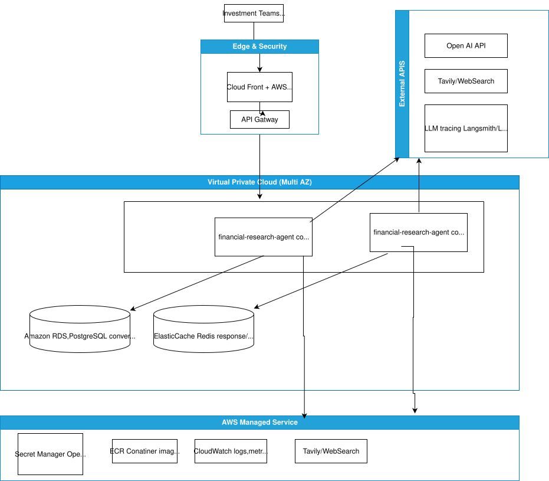
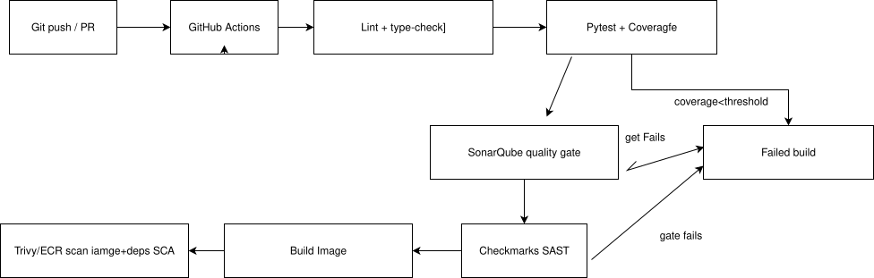

# Deployment Strategy — Finance Research Agent

Target cloud: **AWS**. The service is a stateless, containerised FastAPI app, so
it maps cleanly onto container orchestration behind a load balancer, with
managed datastores and managed observability.

---

## 1. High-level architecture (AWS)

> The `LLM tracing` node assumes a **SaaS** backend (LangSmith or Langfuse Cloud),
> reached as an outbound HTTPS dependency via NAT — no in-VPC components. If data
> residency requires prompts to stay inside the VPC, replace it with a
> **self-hosted Langfuse** stack (see §6.1).

### Why these choices
- **ECS Fargate** (vs. EKS): serverless containers — no node management, fast to
  ship, right-sized for a single service. EKS/Kubernetes is the drop-in
  alternative if the org already standardises on it (the container image is
  identical; only the orchestration manifests change).
- **ALB**: native HTTP/SSE support (required for the streaming endpoint),
  per-target health checks against `/health`, and integrates with WAF + ACM TLS.
- **RDS PostgreSQL**: the demo uses SQLite via the `ConversationStore`
  abstraction; production flips `DATABASE_URL` to RDS — **no code change**.
- **ElastiCache Redis**: caches answers/routing for repeated queries and backs
  distributed rate limiting across replicas.

---

## 4. Reliability

- **Multi-AZ** everywhere: Fargate tasks spread across ≥2 AZs; RDS Multi-AZ with
  automated failover; Redis with replication.
- **Health checks** at three levels: container `HEALTHCHECK`, ALB target-group
  health, and (on EKS) liveness/readiness probes — all hitting `/health`.
- **Graceful degradation**: if Tavily fails, the factory/agent can fall back to
  DuckDuckGo; if search returns nothing, the agent explicitly says so rather
  than hallucinating. LLM client has bounded retries + timeouts.
- **Self-healing**: ECS replaces unhealthy tasks; rolling deploys with circuit
  breaker + automatic rollback on failed deployment.
- **Backups**: RDS automated snapshots + point-in-time recovery.

---

## 5. Security

- **Secrets** in AWS Secrets Manager (or SSM Parameter Store), injected as env
  vars at task start — never baked into the image or git.
- **Network**: tasks and datastores in **private subnets**; only the ALB is
  public. Security groups least-privilege; outbound to OpenAI/Tavily via NAT.
- **Edge**: AWS WAF (managed rule sets, rate limiting, IP/geo allowlists) +
  TLS 1.2+ via ACM. Optional API Gateway for API-key issuance and per-key quotas
 - **Data**: encryption at rest (RDS/Redis/ECR/S3 KMS) and in transit (TLS
  everywhere). PII/logging review since queries may be sensitive.

---

## 6. Observability & monitoring

| Concern | Tool |
|---|---|
| **Logs** | Structured JSON (structlog) → CloudWatch Logs (or Loki). |
| **Metrics** | CloudWatch (CPU/mem, ALB latency/5xx, request count) + app metrics (route mix, search rate, token usage). |
| **Tracing** | OpenTelemetry / AWS X-Ray spans across route → search → LLM. |
| **Alarms** | CloudWatch alarms on p95 latency, 5xx rate, task health, RDS connections → SNS/PagerDuty. |
| **Dashboards** | Per-service dashboard: throughput, latency percentiles, LLM cost, cache hit rate. |

---

## 7. CI/CD pipeline

**Steps:**

1. **Git push / PR** — every push or pull request triggers the pipeline.
2. **GitHub Actions** — CI runner that orchestrates all stages below.
3. **Lint + type-check** — style/lint (ruff) and static types (mypy); fast fail on basics.
4. **pytest + coverage** — run the unit suite and measure coverage; fails if below the threshold.
5. **SonarQube** — code-quality gate (bugs, smells, duplication); ingests the coverage report.
6. **Checkmarx (SAST)** — static security scan of the source; blocks on high/critical findings.
7. **Build image** — build the multi-stage Docker image (immutable git-SHA tag).
8. **Trivy / ECR scan** — scan the built image for vulnerable OS packages and dependencies (SCA).
9. **Push to ECR** — publish the passing image to the container registry.
10. **ECS rolling deploy** — blue/green rollout via CodeDeploy behind the ALB.
11. **Health smoke test** — hit `/health` on the new tasks to confirm a healthy release.
12. **Fail build / Auto rollback** — any gate failure stops the pipeline; a failed smoke test auto-rolls back to the previous version.

